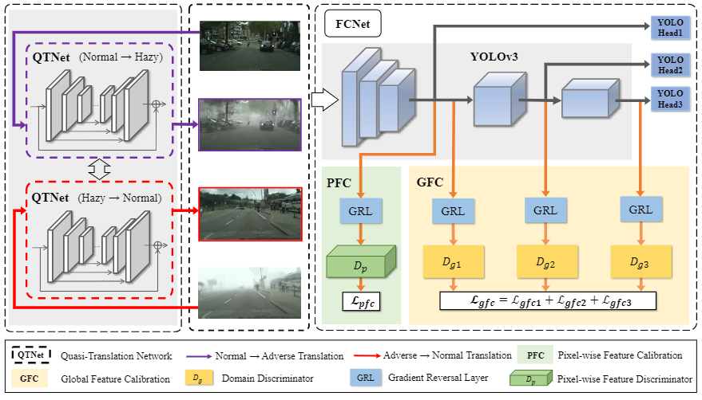

# R-YOLO: A Robust Object Detector in Adverse Weather

Here, we provide detailed instructions to help replay our experiments. To make it easy to reproduce our research results.

This project is the complete code of R-YOLOv5, other YOLO series can be implemented in the same method, we give an overview of the environment installation and adaptation experiment.


## Environment installation

```shell
# create conda env
conda create -n R_YOLO python=3.8
# activate the enviorment
conda activate R_YOLO
# install 
pip install -r requirements.txt
```

## Dataset download and convert dataset format 

1. Dataset download

* **Cityscape and FoggyCityscape:**  Download Cityscapes dataset and Foggy-Cityscapes [here](https://www.cityscapes-dataset.com/), see dataset preparation code in [DA-Faster RCNN](https://github.com/yuhuayc/da-faster-rcnn/tree/master/prepare_data), and convert format from PASCAL_VOC to YOLO.
* **RTTS:** Please follow the [instruction](https://sites.google.com/site/boyilics/website-builder/reside) to prepare dataset.
* **RainCityscape:** Please follow the [instruction](https://www.photoshopessentials.com/photo-effects/photoshop-weather-effects-rain/) to prepare dataset.

2. Organize the dataset as following:

```shell
# the dataset format follow YOLO format.(e.g., Cityscapes to Foggy-Cityscapes)
R_YOLO/
└── datasets/
    └── Normal_to_Foggy/
        └── images/
            ├── Normal_train
            ├── Foggy_train
            └── Foggy_val
        └── labels/
            ├── Normal_train
            └── Foggy_val
```

## Training

### Step 1: Training the QTNet and Preparing the data of translation image

Download the VGG pre-trained model in [here](https://drive.google.com/file/d/199luoCcfhAF_8kydAwziOIPVqyiLECbN/view?usp=sharing).
```shell
# train the model of normal_to_adverse
python QTNet_train.py --mode normal_to_adverse --input_dir ./dataset/Normal_to_Foggy/images/Normal_train/
                      --gt_dir ./dataset/Normal_to_Foggy/images/Foggy_train/
# train the model of adverse_to_normal
python QTNet_train.py --mode adverse_to_normal --input_dir ./dataset/Normal_to_Foggy/images/Foggy_train/ \
                      --gt_dir ./dataset/Normal_to_Foggy/images/Normal_train/
# generate the normal translation image 
python QTNet_infer.py --mode normal_to_adverse --input_dir ./dataset/Normal_to_Foggy/images/Normal_train/ \
                      --weight ./runs/QTNet_weights/normal_to_foggy/_49.pth
# generate the adverse translation image 
python QTNet_infer.py --mode adverse_to_normal --input_dir ./dataset/Normal_to_Foggy/images/Foggy_train/ \
                      --weight ./runs/QTNet_weights/foggy_to_normal/_49.pth
# move the translation image
mv ./dataset/Normal_to_Foggy/images/Foggy_feak/* ./dataset/Normal_to_Foggy/images/Foggy_train/
mv ./dataset/Normal_to_Foggy/images/Normal_feak/* ./dataset/Normal_to_Foggy/images/Normal_train/
```
After generating the translation image, copy the label of the origin image as the label of the translation image.

### Step 2: Training the FCNet


```shell

python train_FCNet.py --data VOC.yaml --cfg yolov5m.yaml --weights yolov5m.pt --batch-size 16 --img-size 640

```

## Evaluation

```shell
# or choose your best model 
python val.py -- weight ./runs/weights/best.py

```

## Models
### Pre-trained Models

|  Model   |                       |                                         Model Weights                                       |
| :-----:  | :------------------:  |  :----------------------------------------------------------------------------------------: |
| YOLOv5-M |       pre-trained        |  [yolov5m.pt](https://drive.google.com/file/d/1mgOF5k6SZHiHsrQWSzDZ6-KmPplDI2hA/view?usp=sharing) |
| YOLOv5-M | normal+foggy(unlabel) |  [adaptive_best.pt](https://drive.google.com/file/d/15Ocoz0Xm0K5PctU4wRNheKZYmGWFxN_C/view?usp=sharing) |
